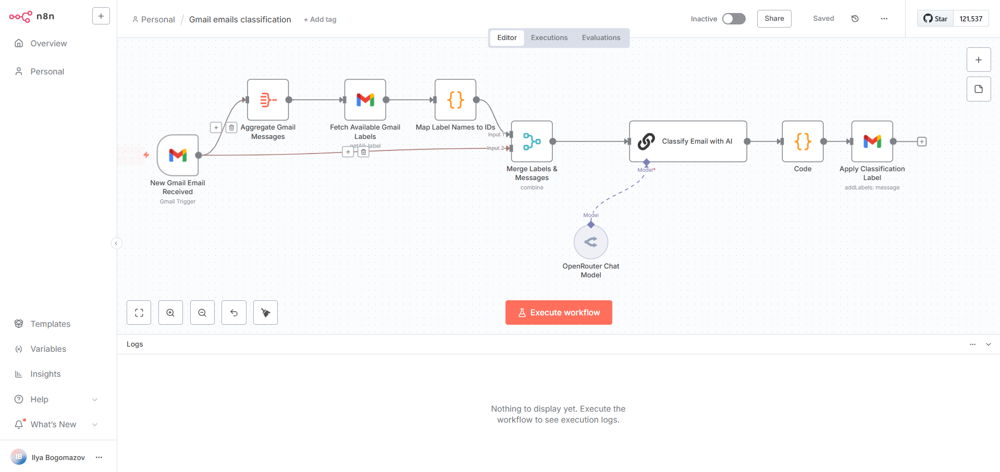

# 📧 Gmail Email Classification (n8n + LLM)

AI-интеграция для автоматической классификации входящих писем Gmail по категориям с помощью LLM. Проект реализован на платформе **n8n** с использованием API OpenRouter или Ollama.

## 🧠 Что делает проект

- Получает новые письма через Gmail Trigger
- Обрабатывает текст письма и передаёт в LLM
- LLM классифицирует письмо по категориям: 📌 Important, 📄 Docs, 📬 Newsletter, ⚠️ Spam и т.п.
- Классификация сохраняется как label, tag или записывается в Google Sheet

## ⚙️ Стек технологий

- **n8n** — визуальный редактор workflow
- **OpenRouter / Ollama** — подключение LLM (Mistral, Phi3, GPT-3.5)
- **Gmail API** — получение писем
- **Google Sheets API / Notion API** — логирование результатов (опционально)

## 🚀 Как запустить

1. Установи `n8n` локально или используй n8n.cloud  
2. Импортируй файл `src/gmail-classifier-workflow.json`  
3. Создай `.env` на основе `.env.example`  
4. Подключи Gmail, LLM (OpenRouter API key или Ollama), Sheets (опц.)

## 🖼️ Скриншоты

_Пример рабочего сценария:_

## 🔐 Переменные окружения (.env.example)

## 📄 Лицензия

Проект доступен под лицензией MIT. См. файл [LICENSE](LICENSE) для подробностей.
